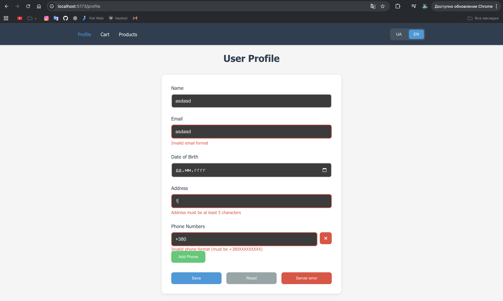
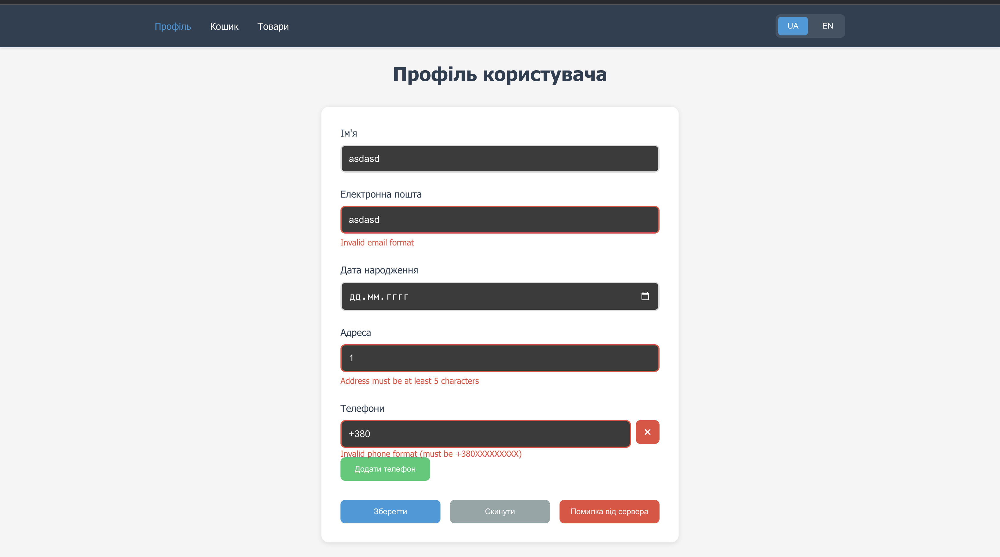
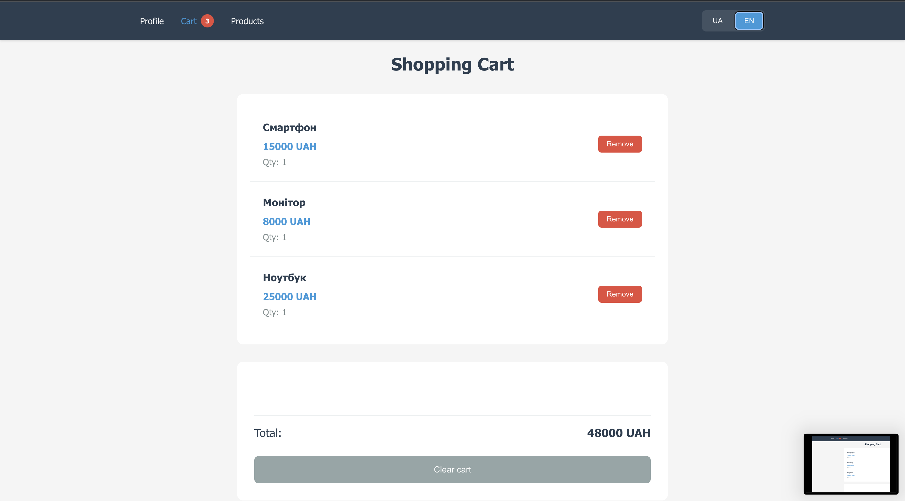
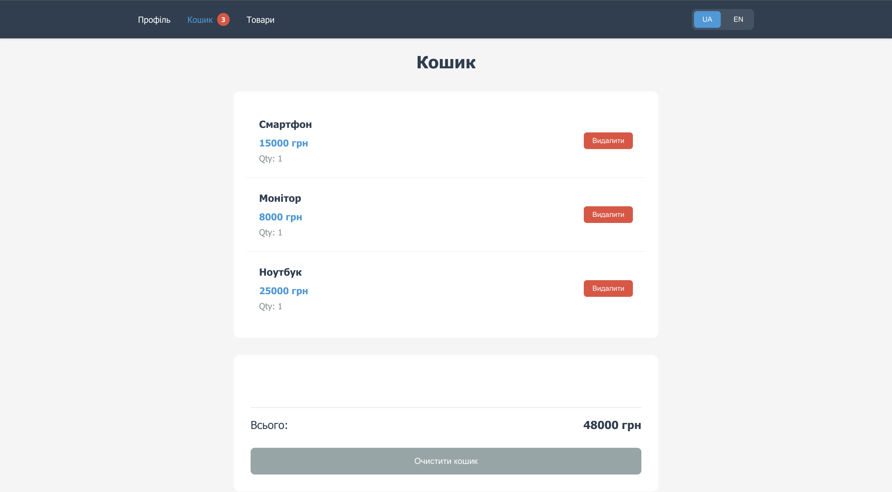

# Лабораторна робота 4 - Profile & Cart

## Кроки запуску
```bash
npm create vite@latest lab4 -- --template vue
cd lab4
npm install pinia pinia-plugin-persistedstate vue-i18n@9 vee-validate yup vue-router
npm run dev
```

## Перелік сторів

1. **settings.js** - мова інтерфейсу (locale)
2. **cart.js** - товари в кошику, totalCount, totalPrice
3. **products.js** - список товарів

## Де застосовано технології

### Pinia
- **createPinia** - `main.js` (рядок 6-7)
- **defineStore** - всі файли в `stores/`
- **storeToRefs** - `App.vue` (рядок 11), `Navigation.vue` (рядок 25), `CartView.vue` (рядок 9)
- **persistedstate** - `stores/settings.js` (рядки 13-16):
    - `key: 'app-settings'` - власний ключ
    - `pick: ['locale']` - зберігаємо тільки locale

### vue-i18n
- **createI18n** - `i18n.js` (рядок 15)
- **messages** - `locales/ua.json` та `locales/en.json`
- **кастомний модифікатор** - `i18n.js` (рядок 9): `star: (str) => ':) ${str} :)'`
- **синхронізація** - `App.vue` (рядки 13-19): watch(storeLocale) → locale.value

### VeeValidate
- **useForm** - `ProfileView.vue` (рядок 40)
- **useField** - `ProfileView.vue` (рядки 47-50)
- **useFieldArray** - `ProfileView.vue` (рядок 52): динамічний масив телефонів
- **validationSchema (Yup)** - `ProfileView.vue` (рядки 14-36)
- **setFieldError** - `ProfileView.vue` (рядок 66): емуляція помилки сервера






